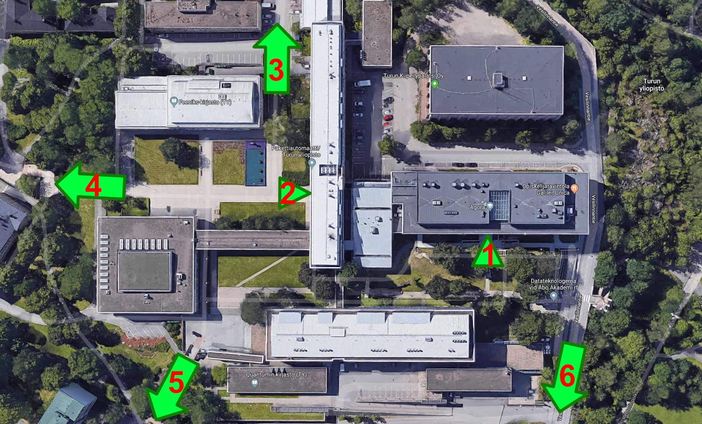

# Maps

Useful maps

## Campus map

<iframe width="100%" height="400px" src="https://www.google.com/maps/d/embed?mid=1kBVBeGfNYBHgeJbEwcxDlXgSbTB9M5Gp"></iframe>

---

## Agora

### Aerial view

1. Agora main entrance
2. Natura main entrance
3. To Axelia II and rest of campus
4. To the church
5. To Hämeenkatu / Tavastgatan
6. To Assarin Ullakko

### Ground level (1)

### Cellar level (-1)

