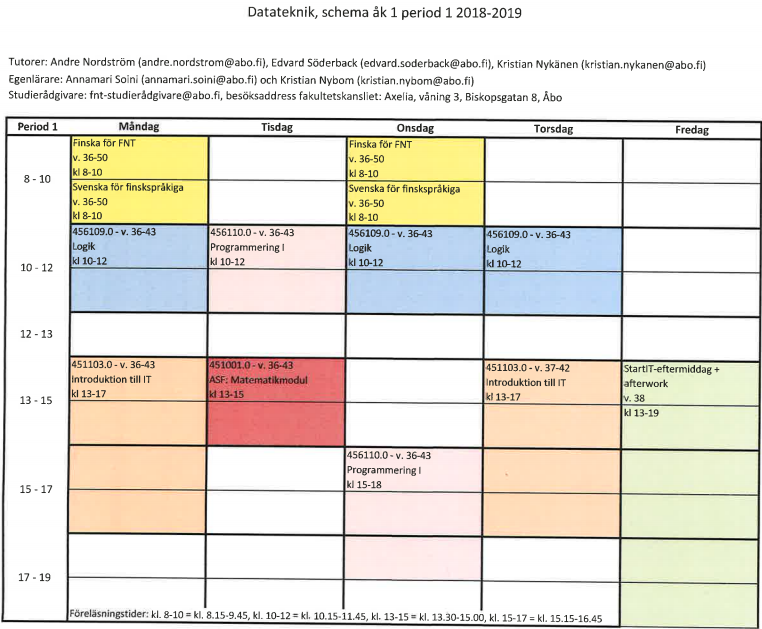

# Congratulations and welcome to Computer engineering at Åbo Akademi University

This page will help you with the basics (who to contact etc.) and get you started with your studies.

## Tutors

These guys help you with any questions that you may come up with. The tutors help you throughout the first year.

You can contact them via [Telegram](COMMUNICATION.md#telegram) or by [email](COMMUNICATION.md#email).

| Tutors 2018               |
| ------------------------- |
| André Nordström           |
| Edvard "Diza" Söderback   |
| Kristian Nykänen          |

Full-blown tutor greeting: [imgur](https://imgur.com/a/fZdNxxt)

## Intro-week

Time: **27.-31.8.2018**

During the introduction week, you will

* Meet the tutors
* Meet new people
* Become familiar with campus and the university
* Learn about [TEK and TFiF](TEKTFIF.md)
* Have fun!

**The schedule for the introduction week can be found [here](https://www.abo.fi/wp-content/uploads/2018/06/Studorientering-IT.pdf).**

**Tutors and student associations will host evening activities for you. This is not mandatory but highly recommended.**

Here's a preliminary schedule for evening activities

| Monday   | Tuesday     | Wednesday         | Thursday   | Friday   | Weekend     |
| ---------|--------------|-------------------|------------|----------|-------------|
| TFiF GP  | Tour de Åbo  |ASK in Kuppisparken| Rest-day   | Sitz     | -           |

## Courses

The courses can be found here in the [studienhandboken](http://studiehandboken.abo.fi/sv/degree-programme/5071). You need to open each course to see when it is actually held...

Also note: Some things are not great in life... This site should not be viewed from a phone, hopefully will be updated soon.

// TODO: add some cool parsing stuff here

## Scheme

